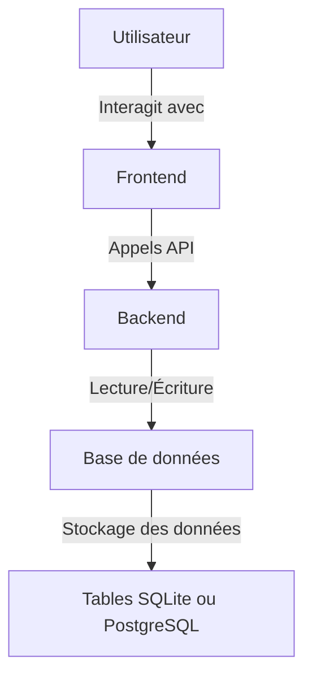

```mermaid
flowchart TD
    A[Utilisateur] -->|Interagit avec| B[Frontend]
    B -->|Appels API| C[Backend]
    C -->|Lecture/Écriture| D[Base de données]
    D -->|Stockage des données| E[Tables SQLite ou PostgreSQL]

```