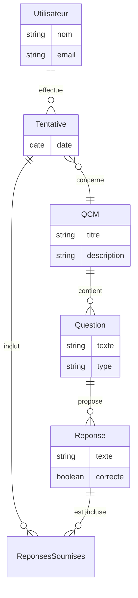

```mermaid
erDiagram
    Utilisateur {
        string nom
        string email
    }
    QCM {
        string titre
        string description
    }
    Question {
        string texte
        string type
    }
    Reponse {
        string texte
        boolean correcte
    }
    Tentative {
        date date
    }
    ReponsesSoumises {
    }

    Utilisateur ||--o{ Tentative : "effectue"
    QCM ||--o{ Question : "contient"
    Question ||--o{ Reponse : "propose"
    Tentative }o--|| QCM : "concerne"
    Tentative ||--o{ ReponsesSoumises : "inclut"
    Reponse ||--o{ ReponsesSoumises : "est incluse"

```