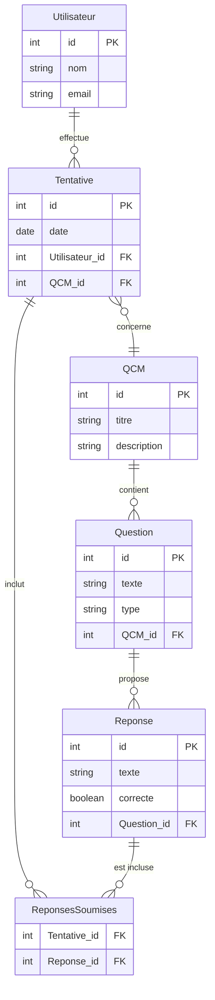

```mermaid
erDiagram
    Utilisateur {
        int id PK
        string nom
        string email
    }
    QCM {
        int id PK
        string titre
        string description
    }
    Question {
        int id PK
        string texte
        string type
        int QCM_id FK
    }
    Reponse {
        int id PK
        string texte
        boolean correcte
        int Question_id FK
    }
    Tentative {
        int id PK
        date date
        int Utilisateur_id FK
        int QCM_id FK
    }
    ReponsesSoumises {
        int Tentative_id FK
        int Reponse_id FK
    }

    Utilisateur ||--o{ Tentative : "effectue"
    QCM ||--o{ Question : "contient"
    Question ||--o{ Reponse : "propose"
    Tentative }o--|| QCM : "concerne"
    Tentative ||--o{ ReponsesSoumises : "inclut"
    Reponse ||--o{ ReponsesSoumises : "est incluse"

```